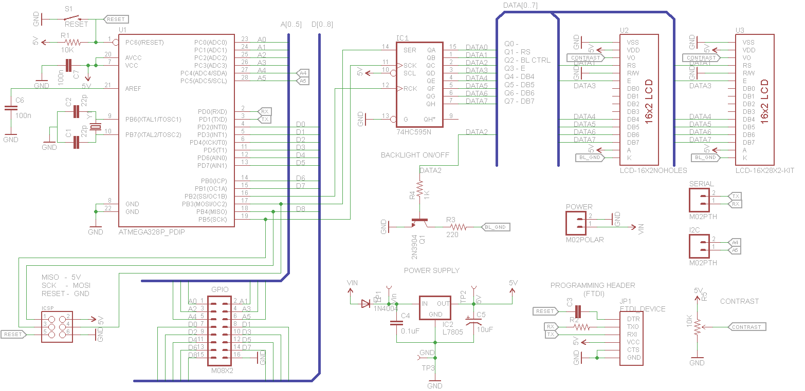

# LCD Backpack (serial/I2C)

[Arduino](https://www.arduino.cc/) based character LCD driver circuit, with a form factor that lets it be mounted to the back of a display.
It can be used with any [Hitachi HD44780](https://en.wikipedia.org/wiki/Hitachi_HD44780_LCD_controller) based LCD, or compatible VFD displays (ex.: [Noritake-Itron VFDs](http://www.noritake-itron.com/NewWeb/GVFD/Overview/Overview.asp)).
Supports displays with a single row (1x16) or double row (2x8) connectors.
The display is controlled through a [74HC595](http://www.nxp.com/documents/data_sheet/74HC_HCT595.pdf) shift register.

## Features
* Supports any Hitachi HD44780 based character LCD (or VFD)
* 1x16 and 2x8 pins
* Arduino compatible device with most of the GPIO pins accessible
* Serial and [I2C](https://en.wikipedia.org/wiki/I%C2%B2C) ports
* [FTDI](https://www.adafruit.com/product/284) and (6 pin) [ICSP](https://en.wikipedia.org/wiki/In-system_programming) programming ports
* On-board voltage regulator
* Contrast pot
* Backlight controllable from code (QC pin on the shift register)
* It is the same size as a 16x2 character LCD (also the mounting holes line up)

## Ports
* Serial (D0, D1)
* I2C (A4, A5)
* FTDI header
* ICSP

## Usable Arduino GPIO pins
* Analog: A0, A1, A2, A3, A4, A5
* Digital: D2, D3, D4, D5, D6, D7, D8, D9, D12

## Power supply
The board has an on board power connector, that powers the backpack and the display too.
You can use a voltage regulator like the [LD1117](http://www.st.com/web/en/resource/technical/document/datasheet/CD00000544.pdf), or if you have a regulated power supply, you can just leave it unpopulated and short pins 2 and 3 together.

## Shift register pinout
* QA  - Not connected 
* QB  - LCD RS
* QC  - LCD Backlight control
* QD  - LCD E
* QE  - LCD DB4
* QF  - LCD DB5
* QG  - LCD DB6
* QH  - LCD DB7
* QH* - Not connected
* SER - Arduino D11
* SCK - Arduino D13
* RCK - Arduino D10

## Errata
* Due to the fact, that the enable line of the display is tied to one of the shift register pins, this construction does not work with any of the standard libraries. You need to use the provided library to drive the display!
* In the first version of the board layout the isolation of the ground fill was set to 0. This could have caused a short.

## Pictures
Assembled:

Schematic:

*Made with Cadsoft Eagle v6.5.0*

